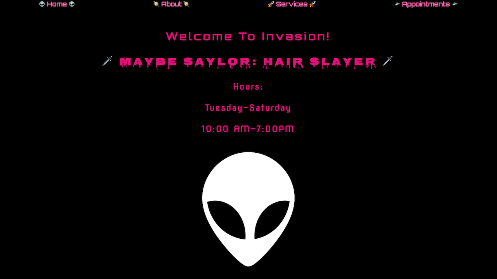
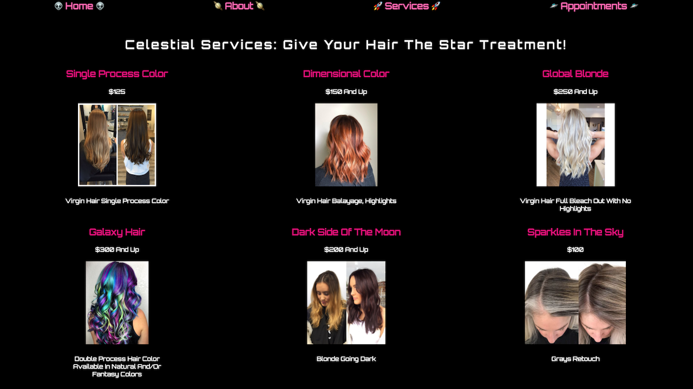
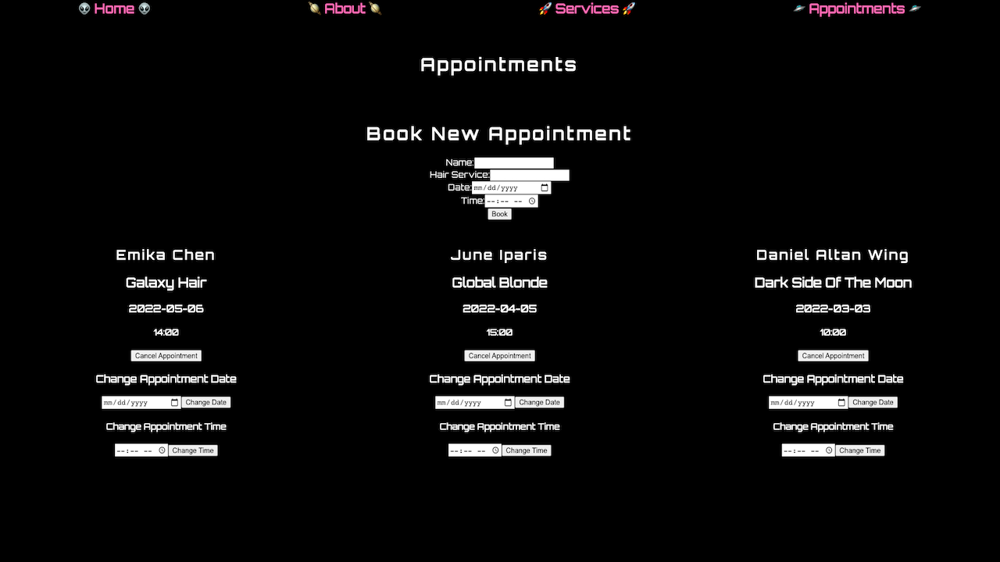

# 
 Invasion Salon

### _Description_

This project will serve as a blueprint for a real-life salon. I have created a full-stack, full CRUD application in which a user can:

- Create Appointments
- Read Salon services, About page, and Created Appointments
- Update Appointments
- Delete Appointments

Future Updates will include:

- User Authentication
- User-Specific Account and Appointment Information

View the Trello board for the project [here](https://trello.com/b/4HDnz3eN/invasion-salon)

View the ERD for the project [here](https://lucid.app/lucidchart/5e951a9d-a999-4163-b702-d62a151cba8e/edit?beaconFlowId=68857EA6B393B5D0&page=0_0&invitationId=inv_4114c2d7-2ddc-4aa1-87d3-c350c44d396f#)

View the component hierarchy diagram for the project [here](https://lucid.app/lucidchart/4965f83d-ac1e-4074-b7c7-f8cc162e379e/edit?beaconFlowId=786D9770C1E5C6BF&invitationId=inv_be9c6139-cb78-4b06-b7d0-f27fa91164c8&page=0_0#)

---

### Technoloy Used

- MongoDB
- Express JS
- React JS
- Node JS

---

### Site Preview

---

### Credits

ERD reference: [Github](https://github.com/SEI-R-11-8/u2_lesson_ERD)

Site Logo: [SilhouetteGarden](https://silhouettegarden.com/download/alien-head-silhouette/)

General References: [GitHub](https://github.com/SEI-R-11-8)
Lessons
